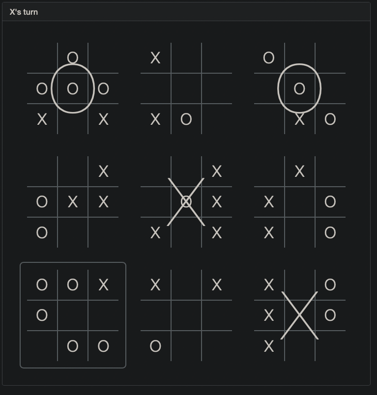

# Ultimate Tic-Tac-Toe (OCaml & Rescript)

This repository contains code for running ultimate tic-tac-toe using Rescript and OCaml.

## Project Proposal

The purpose of this project is to create a game of ultimate tic-tac-toe that can be played as a web application through the use of OCaml and Rescript.

The project proposal is split up into multiple different parts within our repository.

A mock of the application is basically a game of tic-tac-toe with a game of tic-tac-toe in each square. A mock screenshot of the application is below, and game rules can be found in `./ThePlan.md`

The commented module types are currently under `FPSE_Final_Project/src/ultimatettt.mli`, with the rendering steps at the end of `./ThePlan.md`. Additionally, we have `.resi` module types that split up these module types in `ultimatettt.mli` within our app folder, `FPSE_Final_Project/app/ultimate`

The libraries we plan on using are within the requirements below; we plan on using Rescript, which is essentially OCaml with more bells and whistles to allow for frontend implmementation. We have verified that Rescript works for us, and a project shell exists under `FPSE_Final_Project/app/ultimate`, which we used with local tutorial examples.

Additionally, the list of what order we will implement features is contained within `./ThePlan.md`.

/You may also include any other information which will make it easier to understand your project.

## Package Requirements

- OCaml version 4.14.0
- Rescript
